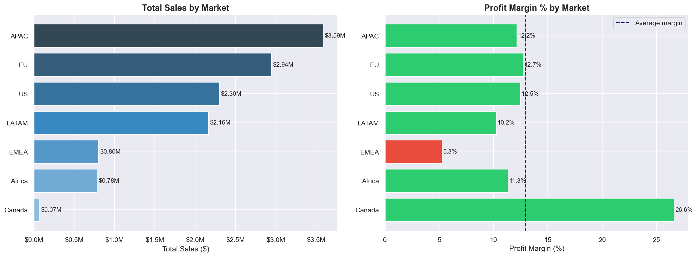
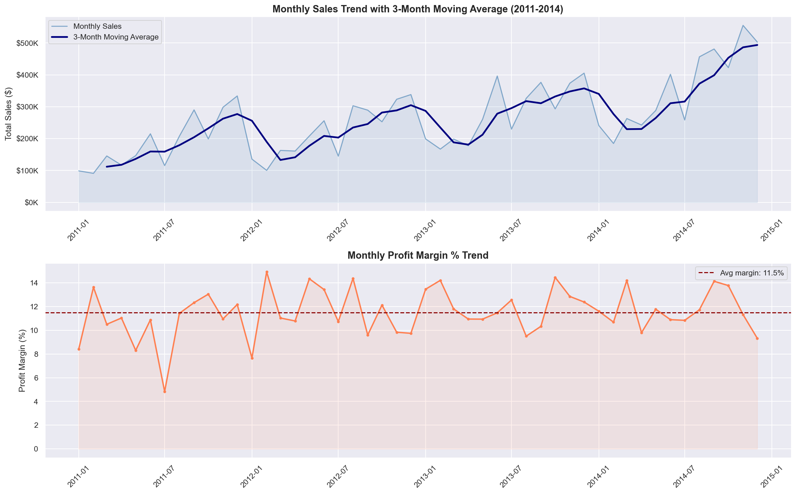
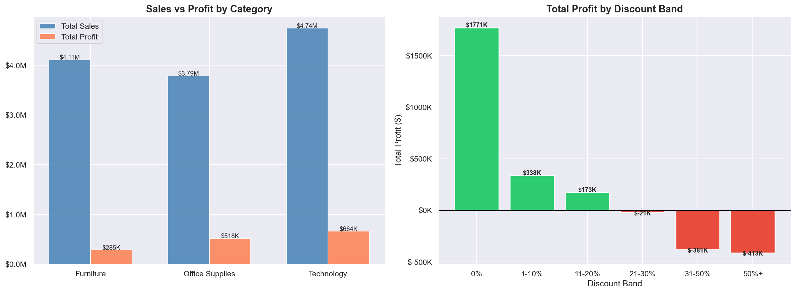
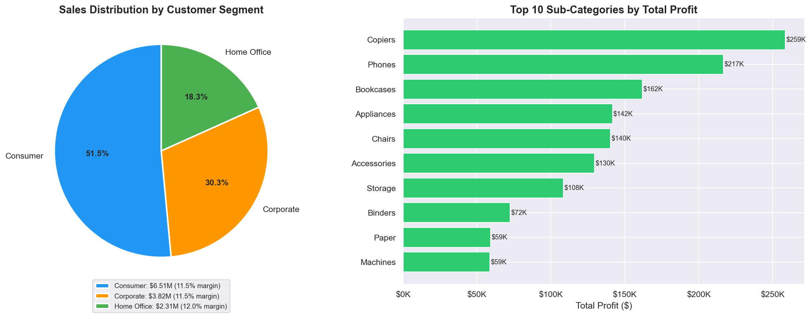
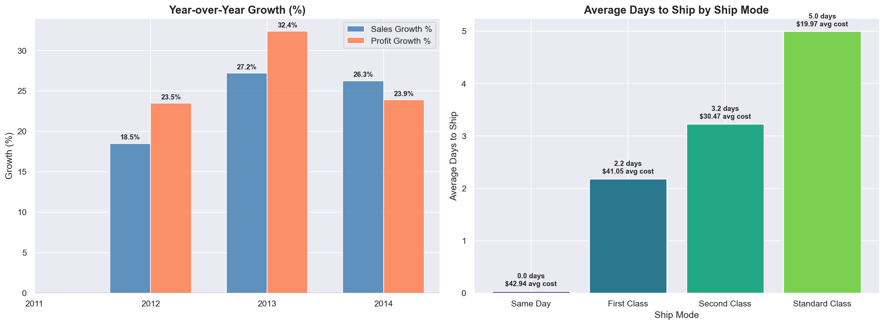

# 🛒 Retail Sales Performance BI Dashboard


## 📊 Live Dashboard
👉 [View Interactive Tableau Dashboard](#) *(coming soon)*

---

## 📌 Executive Summary
Analysis of **51,290 retail order lines** across **147 countries** and **4 years (2011–2014)** for a global superstore operation. Total portfolio value of **$12.6M in sales** generating **$1.47M profit** at an **11.6% overall margin**.

Three critical findings emerged: APAC is the largest market at $3.59M but Canada delivers the highest margin at 26.6%. Technology drives the most profit at $664K. Most importantly, **any discount above 20% destroys profitability entirely**, costing the business $814K in losses on discounted orders alone.

---

## 🎯 Business Questions Answered
1. Which markets and regions generate the highest sales and profit?
2. Which product categories and sub-categories are most profitable?
3. How has the business grown year-over-year from 2011 to 2014?
4. Which customers are Champions, Loyal, or At Risk based on RFM scoring?
5. What is the precise impact of discounting on profitability?
6. Which products appear in both the top revenue and top profit rankings?
7. What are the monthly sales trends and seasonal patterns?

---

## 🏗️ Architecture
```
superstore.csv (raw flat file)
       ↓
PostgreSQL 18 (star schema)
  ├── dim_customers   (4,873 unique customers)
  ├── dim_products    (10,292 unique products)
  ├── dim_geography   (3,812 unique locations)
  ├── dim_date        (1,430 unique dates)
  └── fact_orders     (51,290 order lines)
       ↓
Python (SQLAlchemy → PostgreSQL)
  └── EDA and visualisations queried directly from database
       ↓
Tableau (PostgreSQL connector)
  └── Interactive dashboard connected to live database
```

> All analysis runs against PostgreSQL. The CSV is used only once for the initial load. Python and Tableau both connect directly to the database - no CSV files used in analysis.

---

## 📁 Project Structure
```
retail-sales-bi/
├── data/
│   └── superstore.csv                      # Raw dataset (51,290 records)
├── sql/
│   └── retail_analysis.sql                 # 8 advanced SQL queries
├── python/
│   ├── load_data.ipynb                     # Star schema data loader
│   ├── retail_eda.ipynb                    # Full EDA Jupyter Notebook
│   ├── chart1_sales_by_market.png          # Market performance chart
│   ├── chart2_sales_trend.png              # Sales trend chart
│   ├── chart3_category_discount.png        # Category and discount chart
│   ├── chart4_segments_subcategories.png   # Segment analysis chart
│   └── chart5_growth_shipping.png          # Growth and shipping chart
├── tableau/
│   └── retail_dashboard.twbx               # Tableau dashboard (coming soon)
└── README.md
```

---

## 🗄️ Dataset
| Attribute | Detail |
|---|---|
| Source | [Kaggle - Global Superstore Dataset](https://www.kaggle.com/datasets/fatihilhan/global-superstore-dataset) |
| Records | 51,290 order lines |
| Columns | 27 (split into 5 tables in the star schema) |
| Date Range | January 2011 to December 2014 |
| Coverage | 147 countries, 13 regions, 7 markets |

---

## 🔍 Data Quality Findings
| Issue | Detail | Resolution |
|---|---|---|
| Corrupted column name | Chinese characters in one column header | Dropped on load (row counter, not needed) |
| Duplicate column | Market and Market2 contained same data | Kept Market, dropped Market2 |
| Derived columns | Year and weeknum already in raw file | Rebuilt cleanly in dim_date |
| Sales stored as integer | Lost decimal precision | Cast to NUMERIC(12,4) in PostgreSQL |
| Missing values | Zero nulls across all columns | No action needed |

---

## 🗃️ Star Schema Design

| Table | Rows | Key Fields |
|---|---|---|
| fact_orders | 51,290 | sales, profit, quantity, discount, shipping_cost |
| dim_customers | 4,873 | customer_id, customer_name, segment, market |
| dim_products | 10,292 | product_id, product_name, category, sub_category |
| dim_geography | 3,812 | city, state, country, region, market |
| dim_date | 1,430 | order_date, year, quarter, month, week_num, day_of_week |

---

## 📊 SQL Analysis

Eight advanced queries written in PostgreSQL demonstrating:
`CTEs` `Window Functions` `RANK()` `LAG()` `NTILE()` `PARTITION BY` `NULLIF()` `DATE_TRUNC()` `Moving Averages` `RFM Scoring`

| Query | Description |
|---|---|
| 1 | Star schema verification - all 5 tables joined, full portfolio overview |
| 2 | Sales and profit by market and region with margin ranking |
| 3 | Product category performance with running profit totals |
| 4 | Year-over-year sales growth using LAG function |
| 5 | Customer RFM segmentation using NTILE window function |
| 6 | Top 10 profit vs top 10 revenue products compared |
| 7 | Discount band impact on profitability |
| 8 | Monthly sales trend with 3-month moving average |

📂 See full queries: [sql/retail_analysis.sql](sql/retail_analysis.sql)

---

## 🐍 Python EDA

Full EDA connected directly to PostgreSQL via SQLAlchemy. No CSV files used in analysis.

📂 Data loader: [python/load_data.ipynb](python/load_data.ipynb)
📂 EDA notebook: [python/retail_eda.ipynb](python/retail_eda.ipynb)

### Sales & Profit by Market


### Monthly Sales Trend with 3-Month Moving Average


### Category Performance & Discount Impact


### Customer Segments & Top Sub-Categories


### Year-over-Year Growth & Shipping Analysis


---

## 💡 Key Findings

| # | Finding | Detail |
|---|---|---|
| 1 | APAC is the largest market | $3.59M in sales, 28.4% of total portfolio |
| 2 | Canada has the highest margin | 26.6% profit margin despite being the smallest market |
| 3 | EMEA is underperforming | Only 5.3% margin, the only market below average |
| 4 | Technology leads profit | $664K total profit at 14% margin |
| 5 | Copiers is the single best sub-category | $259K profit at 17% margin from only 2,120 orders |
| 6 | Discounting destroys profit | 0% discount = $1.77M profit, 20%+ discount = -$814K loss |
| 7 | Strong consistent growth | Sales grew 90.4% from $2.26M (2011) to $4.30M (2014) |
| 8 | July seasonal dip every year | Consistent -40% to -46% MoM drop each July |
| 9 | Consumer segment dominates | 51.5% of sales but same margin as Corporate and Home Office |
| 10 | Same Day shipping costs most | $42.94 avg vs $19.97 for Standard Class |

---

## 📋 Business Recommendations

1. **Eliminate discounts above 20% immediately.** The business loses $814K on high-discount orders. Cap all discounts at 20% and redirect that margin into APAC expansion where returns are strongest.

2. **Prioritise Copiers and Technology sales.** Copiers generate $259K profit from only 2,120 orders - the highest profit-per-order ratio in the portfolio. A targeted sales push in this sub-category would yield outsized returns.

3. **Investigate EMEA urgently.** At 5.3% margin, EMEA is the only below-average market. Root cause analysis should examine whether high discounting, unfavourable product mix, or high shipping costs are driving this underperformance.

4. **Build a seasonal promotions strategy.** The consistent July dip every year is predictable. Pre-July inventory adjustments and targeted promotions in June could smooth revenue and reduce the annual trough.

5. **Develop Canada as a high-margin growth market.** Canada delivers 26.6% margin - more than double the portfolio average - but contributes only $74K in sales. Increasing customer acquisition in Canada would be highly accretive to overall profitability.

---

## ⚠️ Limitations

- Dataset covers 2011 to 2014 only and does not reflect current market conditions
- No cost of goods data available, so margin calculations reflect gross profit only
- Customer return rates are not captured, which may overstate profitability for some segments
- Geographic analysis uses city-level data which may have occasional inconsistencies for international locations

---

## 🔲 Next Steps
- [ ] Complete Tableau dashboard with PostgreSQL live connection
- [ ] Add customer churn prediction model using Python (Project 3)
- [ ] Build automated monthly reporting pipeline (Project 4)
- [ ] Incorporate returns data to calculate net revenue per customer

---

## ⚙️ How to Run This Project

### Setup
```bash
pip install pandas sqlalchemy psycopg2-binary matplotlib seaborn jupyter
```

### Database
1. Install PostgreSQL 18
2. Create a database called `retail_sales_dw`
3. Run `python/load_data.ipynb` to build the star schema and load data
4. Execute queries in `sql/retail_analysis.sql`

### Python EDA
```bash
jupyter notebook python/retail_eda.ipynb
```

---

## 👤 Author
**Dennis Njiru Aningu**
Senior Data Analyst | SQL, Python, Tableau, Power BI, Excel

[](https://www.linkedin.com/in/dennisnjiru/)
[](https://github.com/NjiruDennis)
[](https://github.com/NjiruDennis/healthcare-claims-analytics)
